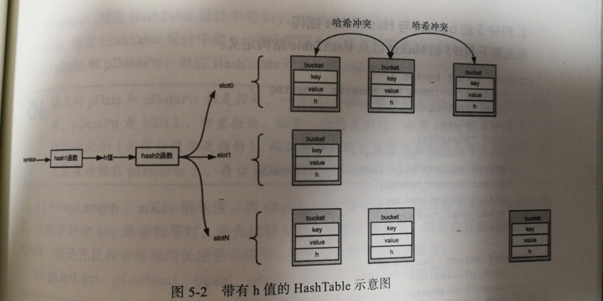

### PHP数组是一个有序的字典，它必须同时满足下面两个语义

1. PHP数组是一个字典，存储着键-值（key-value）对，通过键可以快速地找到对应的值，键可以是整形、字符串。

2. PHP数组是有序的，这个有序是指插入顺序，即遍历数组的时候，遍历元素的顺序应该和插入的顺序一致。

为了实现语义1，PHP使用 HashTable 来存储 key-value ，但是 HashTable 只能保证语义1

- php使用了带h值的 HashTable

`key/value -> hash1函数 -> h值 -> hash2函数 -> slotN -> bucket()`

示意图：



1. bucket里面增加了 h 字段

2. hash函数拆分成 hash1 和 hash2 函数，hash1 将 key 映射成 h值，hash2 将 h 值映射为 slot 的索引值

3. bucket 里的 key 作为字符串key
```
HashTable 的key可能为数字，也可能是字符串，如果是数字那么 h值就代表数字key，如果是字符串，计算出h值，key1和key2比较时
先比较它们的h值是否相等，如果相等在比较key1和key2是否相等，因为大部分场景，不同字符串的h值都不会相等，这样提高了 HashTable
的插入、查找速度。
```
### 数组的基本结构

```c
typedef struct _zend_array zend_array;
typedef struct _zend_array HashTable;

//Bucket：散列表中存储的元素
typedef struct _Bucket {
    zval              val; //存储的具体value，这里嵌入了一个zval，而不是一个指针
    zend_ulong        h;   //key根据times 33计算得到的哈希值，或者是数值索引编号
    zend_string      *key; //存储元素的key
} Bucket;

//HashTable结构
typedef struct _zend_array HashTable;
struct _zend_array {
    zend_refcounted_h gc;   // 引用计数相关
    union {
        struct {
            ZEND_ENDIAN_LOHI_4(
                    zend_uchar    flags,    // 
                    zend_uchar    nApplyCount,  // 递归遍历计数，为了解决循环引用导致死循环的问题
                    zend_uchar    nIteratorsCount,  // 迭代器计数器
                    zend_uchar    reserve)
        } v;
        uint32_t flags;
    } u;
    uint32_t          nTableMask; //哈希值计算掩码，等于nTableSize的负值(nTableMask = -nTableSize)
    Bucket           *arData;     //存储元素数组，指向第一个Bucket（连续的内存）
    uint32_t          nNumUsed;   //已用Bucket数
    uint32_t          nNumOfElements; //哈希表有效元素数
    uint32_t          nTableSize;     //哈希表总大小，为2的n次方
    uint32_t          nInternalPointer; // 全局游标 与 reset/key/current/next/prev函数有关
    zend_long         nNextFreeElement; //下一个可用的数值索引,如:arr[] = 1;arr["a"] = 2;arr[] = 3;  则nNextFreeElement = 2;
    dtor_func_t       pDestructor;  // 析构函数
};

```

- bucket结构分析

1. val 对应 HashTable 设计中的 value 始终是 zval类型（当zval是 IS_PTR类型时，可以通过 zval.value.ptr（指针）指向任何数据类型）

2. h 对应 HashTable 设计中的 h 表示数字key 或者字符串的 h值

3. key 对应 HashTable 设计中的 key

- bucket按使用分类

1. 未使用 初始化时都是未使用

2. 有效 有数据的bucket

3. 无效 被删除的bucket

数组的示意图：


### 为什么 nTableMask 为负数？
```
php7在分配bucket内存的时候，在bucket数组的前面额外多申请了一些内存，这段内存是一个索引数组（索引表），
数组里面的没一个元素代表一个slot，存放着每个slot链表的第一个bucket在bucket数组中的下标。如果当前slot没有任何bucket元素，
那么索引值为 -1 。

这里一个巧妙的设计是索引数组仍然通过 HashTable.arData 来引用，由于索引数组和bucket数组是连续的内存，
因此 arData[0...n-1]表示bucket数组元素，((uint32_t*)(arData))[-1...-n]表示索引数组元素，也就是对应的slot。
```
- 为了得到介于[-1...-n]之间的数组下标，hash2函数按照下面来计算的（nIndex 就是 slot 值）

```c
nIndex = h | ht->nTableMask;
```

以 nTableSize=8 为例， nTableMask=-8 二进制表示为：

11111111 11111111 11111111 11111000   -8

任何整数和它进行按位或之后的结果只有以下8种，恰好满足 [-n, -1]的取值范围：

```c
11111111 11111111 11111111 11111000   -8
11111111 11111111 11111111 11111001   -7
11111111 11111111 11111111 11111010   -6
11111111 11111111 11111111 11111011   -5
11111111 11111111 11111111 11111100   -4
11111111 11111111 11111111 11111101   -3
11111111 11111111 11111111 11111110   -2
11111111 11111111 11111111 11111111   -1
```

### packed array 和 hash array 的区别

```php
$a = [1, 2, 3]; // packed array
$b = ['a' => 'a', 'b' => 'b']; // hash array
```

1. 内存的本质区别

脚本1：

```php
<?php
$memory_start = memory_get_usage();
$test = [];
for ($i = 0; $i <= 20000; $i++) {
    $test[$i] = 1;
}

echo memory_get_usage() - $memory_start, "bytes\n"; // 1052728bytes
```

脚本2：
```php
<?php
$memory_start = memory_get_usage();
$test = [];
for ($i = 20000; $i >= 0; $i--) {
    $test[$i] = 1;
}

echo memory_get_usage() - $memory_start, "bytes\n"; // 1179704bytes
```

2. packed array

- key全是数字

- key按插入顺序排序，仍然是递增的

- 每个key-value 的存储位置都是确定的，都存在bucket数组的第key个元素上

- 不需要索引索引数组 key=NULL

利用了bucket数组的连续的特点，对于某些只有数字的key的场景进行了优化，由于不在需要索引数组，
从内存空间上节省了 (nTableSize-2) * sizeof(uint32_t) 个字节，直接操作bucket数组，性能也有所提升。

### hash冲突解决 

链地址法(php采用) 开放地址法，链地址法就是将同一个slot中的bucket通过链表连接起来

hash array 的做法是，不单独维护一个双链表，而是把每个冲突的 idx 存储在 bucket 的 zval.u2.next 中，
插入的时候把老的value存储的地址(idx)放到新的value的next中，再把新的value的存储地址更新到索引数组中。

假如 第1、2、3个bucket发生hash冲突

1. 插入第1个bucket，对应的 nIndex=-3 那么此时 nIndex=-3 的位置为1

2. 插入第2个bucket，对应的 nIndex=-3，与第1个冲突，令 nIndex=-3 的位置为2，同时将第2个bucket中
zval 的 u2.next=1，这样在查找第1个bucket的key对应的 nIndex时，找到第2个bucket，校验 key值不同，
取 u2.next 的值 1，取第1个bucket中的内容，校验key一致，返回

3. 插入第3个bucket，与第1 2 冲突，同样 令 nIndex=-3 的位置为3 同时将第3个bucket中zval 的 u2.next=2

### 扩容和 rehash 操作

数组再重置一个key时并不会真正触发删除操作，只是做一个标识，删除是在扩容和重进索引时触发

1. hash array 的容量的分配是固定的，初始化的时每次申请的是 2^n 的容量，范围为 2^3 - 0x80000000

2. 当容量足够时直接执行插入操作

3. 当容量不够时(nNumUsed >= nTableSize)，检查已删除元素所占的比例，假如达到阈值，则将已删除的元素从HashTable中移除
并重建索引，如果未达到阈值则进行扩容，扩容为当前大小的2倍，将当前的bucket复制到新的空间，然后重建索引。

4. 重建索引后，有足够空余空间后再执行插入操作。

### zval 的基本结构

```c
//zend_types.h
typedef struct _zval_struct     zval;

typedef union _zend_value {
    zend_long         lval;    //int整形
    double            dval;    //浮点型
    zend_refcounted  *counted;
    zend_string      *str;     //string字符串
    zend_array       *arr;     //array数组
    zend_object      *obj;     //object对象
    zend_resource    *res;     //resource资源类型
    zend_reference   *ref;     //引用类型，通过&$var_name定义的
    zend_ast_ref     *ast;     //下面几个都是内核使用的value
    zval             *zv;       // zval 类型
    void             *ptr;      // 指针类型，可以指向任何类型
    zend_class_entry *ce;       // class 类型
    zend_function    *func;     // function 类型
    struct {
        uint32_t w1;
        uint32_t w2;
    } ww;
} zend_value;

struct _zval_struct {
    zend_value        value; //变量实际的value
    union {
        struct {
            ZEND_ENDIAN_LOHI_4( //这个是为了兼容大小字节序，小字节序就是下面的顺序，大字节序则下面4个顺序翻转
                zend_uchar    type,         //变量类型
                zend_uchar    type_flags,  //类型掩码，不同的类型会有不同的几种属性，内存管理会用到
                zend_uchar    const_flags,  // 常量类型的标记
                zend_uchar    reserved)     //call info，zend执行流程会用到
        } v;
        uint32_t type_info; //上面4个值的组合值，可以直接根据type_info取到4个对应位置的值
    } u1;
    union {
        uint32_t     next;                 //哈希表中解决哈希冲突时用到，记录冲突的下一个位置
        uint32_t     cache_slot;           /* 运行时的缓存 */
        uint32_t     lineno;               /* 对于zend_ast_zval存行号应用在AST节点上 */
        uint32_t     num_args;             /* EX(This) 函数调用时传入的参数个数 */
        uint32_t     fe_pos;               /* foreach 的位置 每执行一次 +1 再次调用 foreach 重置*/
        uint32_t     fe_iter_idx;          /* foreach 游标的标记 针对的是对象 */
        uint32_t     access_flags;          /* 对象类的访问标记 public protected private */
        uint32_t     property_guard;          /* 单一属性保护 防止类中魔术方法的循环调用 */
    } u2;
};

```

### String 的结构

```c
struct _zend_string {
	zend_refcounted_h gc;
	zend_ulong        h;                /* 避免了在数组操作中hash值的重复计算 */
	size_t            len;  // 已使用的内存字符串长度，可以保证二进制读取安全 '\0'
	char              val[1];       // 柔性数组
};
```
